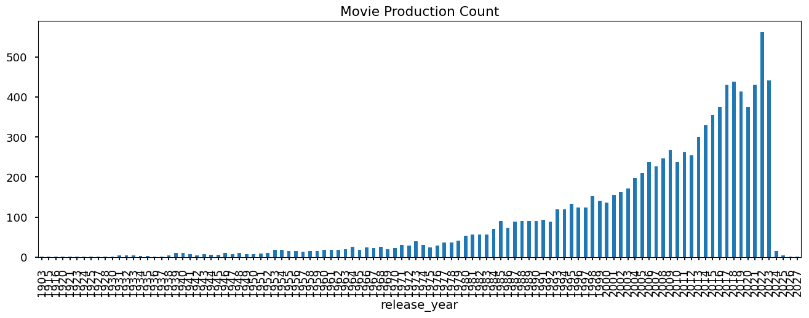
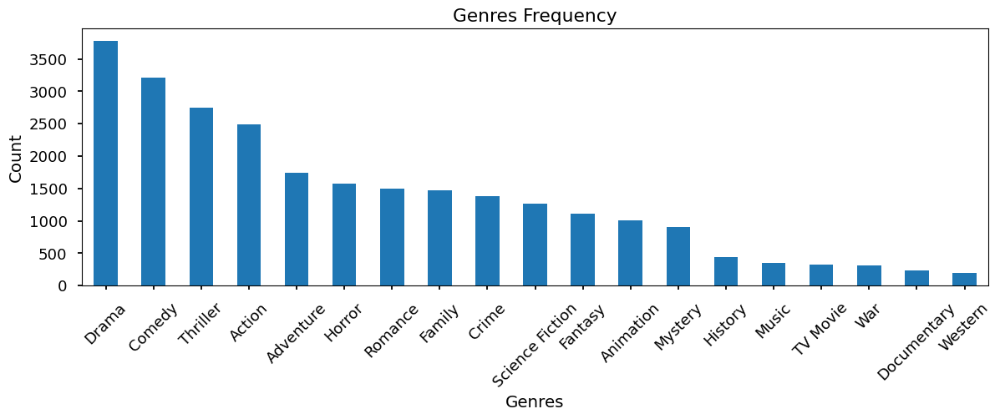

# Holywood Movies : An Analytical
Features Information about popular English Movies that ever produced (Until 2023. And upcoming that revealed on before and 2023) 🎬

## Insight :

1. There are some movies that likely has high popularity even tho the movie was not released yet (as this works written) with details as follows :
    - There are in total 23 titles (2024 :16 | 2025 : 5 | 2026 : 1 | 2027 : 1)
    
2. 2022 Was the peak of enthuasiasm of Holywood's Movies Release. Which is counted around 562 title was released.
3. Holywood is considered to be sucessfull as Movie Industry since its growing on movie production was increased thru years and its incresing popularity
    - 2022 has the most movie release and early 1900's has the least movie released
    
    - 2023 Has the most anticipated movies. It shown by the average popularity is the highest
    
4. Most of movie produced was about Life, World and Finding something or somewhat
    
5. Drama, Comedy, and Thriller was Most produced movies by holywood
    
6. Genres popularity are mostly spiking on 2023
7. Some of genre get recognized on its early release like TV Movies, Music, Animation
8. Some of genre also get recognized on early 2000's like Thriller, Action, Fantasy
9. Some of genre start to be productioned before 1950

    

## To Do

- [x] Looks up the Data
- [ ] Create a NLP model to predict genre based on Overview 

## Approach
- as usual i use `pandas` to read the csv files
- then using `pandas.dataframe.info` i achieve brief information about dataset columns. And indicated less than 5% of the total data.
- Thus the null value is less than 25% using delete rows approach is posible
- with `pandas.dataframe.dropna` i can delete rows that consist null value
- Beside that there is `release_data` column where has `object` as dtype instead of `datetime`
- Using `pd.datetime` i can solve the issue
- With the previous date column that has been converted. I could extract the specific years, month, and day according to its release date
- Using `pd.dataframe.describe` i achieve brief statistic
- After achieve the statistic before, i notice there are a movies that hasn't released yet and already has gain popularity
- using dataframe slicing with `release_year > 2023` i achieve most of movies that hasnt been released yet
- Using `wordcloud` i can achieve what keyword that most movies telling about
- To use `wordcloud` you should install it first just like pandas. in my case i use `conda install -c conda-forge wordcloud`
- After that, i did the analysis approach as usual (like getting information for each column, getting correlation, etc)